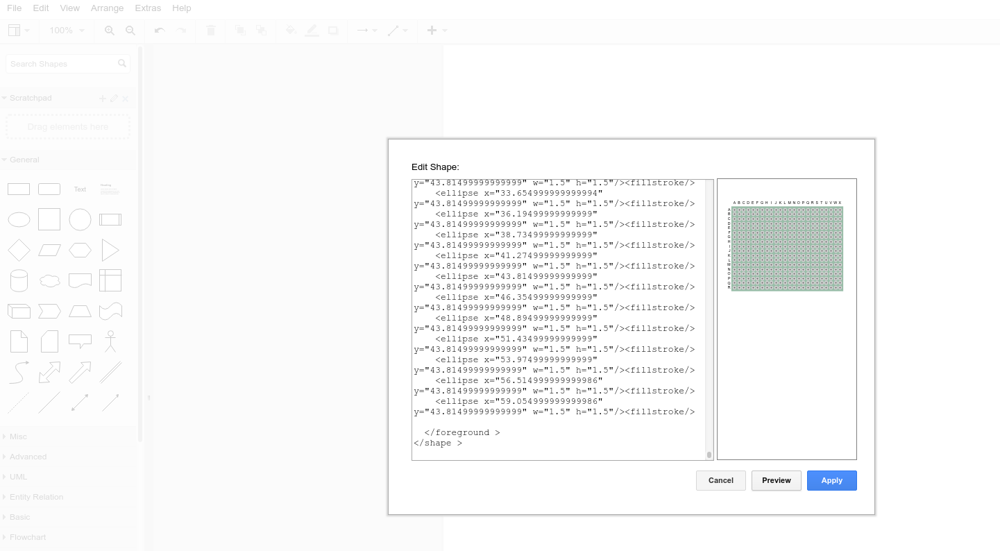
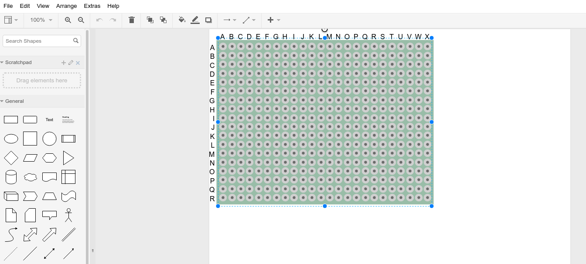

# Prototype / Perf Board Generator for Draw.IO

Generates a perfbaord for electronic prototyping of circuits that can be
pasted into draw.io as a Shape.  The through-holes on the generated board
each have their own connector.

## Usage
```
./drawio_protoboard_generate.py -h

usage: drawio_protoboard_generate.py [-h] [--height HEIGHT] [--width WIDTH]

optional arguments:
  -h, --help       show this help message and exit
  --height HEIGHT  Shape height in mm's (default=46.0)
  --width WIDTH    Shape width in mm's (default=61.0)
```

Use with xclip:
```bash
./drawio_protoboard_generate.py | xclip
```
then paste into the draw.io shape editor:


The shape has a fixed aspect-ratio, so can be resized as needed:

